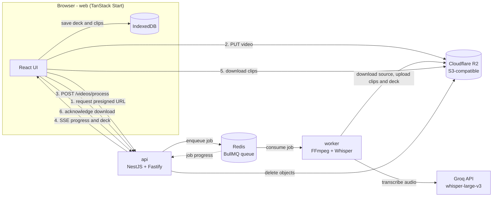

<div align="center">

**English** | [Português](README.pt-BR.md)

# LangClips

**Turn any short video into English listening exercises, with AI-powered transcription, automatic clipping and offline-first practice.**

[](https://github.com/victor-lis-bronzo/langclips/actions/workflows/ci.yml)


https://github.com/user-attachments/assets/439e5b0a-e2dc-4036-a52d-02988145b98f

<sub>Watch the 30s demo</sub>

</div>

<!-- VIDEO: for an inline player, drag docs/media/brag.mp4 into the GitHub editor and paste the generated user-attachments URL here on its own line (see issue #10) -->

---

## Table of contents

- [What is LangClips](#what-is-langclips)
- [How it works](#how-it-works)
- [Difficulty levels](#difficulty-levels)
- [Screenshots](#screenshots)
- [Architecture](#architecture)
- [Engineering decisions](#engineering-decisions)
- [Tech stack](#tech-stack)
- [Repository structure](#repository-structure)
- [Running locally](#running-locally)
- [Tests](#tests)
- [Status and roadmap](#status-and-roadmap)
- [Documentation](#documentation)
- [Author](#author)

## What is LangClips

Learning to understand spoken English from real content (series, movies, interviews) is hard: native speed, accents and connected speech make it easy to "understand half" of what is said, and building exercises from that material by hand takes time.

**LangClips** automates that work. You upload a short video, the platform transcribes it with Whisper, splits it into sentence-sized clips and turns each clip into an interactive listening exercise. No sign-up is required, and once a deck is ready it is stored in your browser, so practice keeps working even without a connection.

## How it works

1. **Upload** - drop an MP4 or MOV file (up to 100 MB). The browser sends it straight to object storage through a presigned URL.
2. **Processing** - a background worker extracts the audio with FFmpeg, transcribes it with Whisper, cuts one clip per transcribed segment (2 to 20 seconds long) and builds a *deck*. The UI follows each step live through Server-Sent Events.
3. **Choose a difficulty** - Easy, Medium or Hard.
4. **Practice with feedback** - watch each clip, answer, and get word-by-word correction. The deck is saved to IndexedDB and the remote files are deleted as soon as the download finishes.

## Difficulty levels

| Level | Exercise | How it works |
| --- | --- | --- |
| **Easy** | Build the sentence | The words of the transcription are shuffled into a **Word Bank**; click them in the right order to rebuild the sentence (click a placed word to send it back). |
| **Medium** | Fill in the blanks | About **35% of the words** stay visible, spread across the sentence; every other word becomes an input to type. |
| **Hard** | Dictation | Type the whole sentence from scratch in a **ruled, notebook-style textarea**. |

Common to all levels:

- **Video player** with play/pause, *Replay* and playback speeds of **0.5x, 0.75x, 1.00x, 1.25x and 1.5x**.
- **Word-by-word correction**: the answer is aligned with the transcription and each word is marked as exact, wrong capitalization, wrong or missing (punctuation and apostrophes are ignored).
- **Progress dots** showing where you are in the deck, and a results screen at the end.

## Screenshots

| Choose a difficulty | Processing pipeline |
| --- | --- |
|  |  |
| **Easy: sentence built, with feedback** | **Hard: dictation with the wrong word in red** |
|  |  |

## Architecture

The project is organized as three independent TypeScript packages (`web`, `api`, `worker`) plus infrastructure, each with its own dependencies and lockfile.



**Processing pipeline (worker).** Each job goes through: download of the original video, audio extraction, transcription, clip generation, clip upload, deck construction and deck upload. The browser adds a final step, saving the deck offline on the device. These are exactly the eight steps shown in the processing stepper.

**Main API endpoints.**

| Method | Route | Purpose |
| --- | --- | --- |
| `POST` | `/uploads/generate-presigned-url` | Returns a short-lived upload URL and the object key |
| `POST` | `/videos/process` | Enqueues the processing job (`202 Accepted`) |
| `GET` | `/videos/events/:jobId` | Server-Sent Events stream with job progress and the final deck |
| `GET` | `/storage/download-url` | Presigned download URL for a clip |
| `POST` | `/videos/acknowledge-download` | Deletes the source video and clips from the bucket |

Interactive docs are served by Swagger at `/docs`, and the queue can be inspected with Bull Board at `/admin/queues`. See [docs/api-spec.md](docs/api-spec.md) for the full specification.

## Engineering decisions

- **Asynchronous processing with a queue.** Audio extraction, transcription and clipping are slow and CPU-heavy, so they never run inside an HTTP request. The API only enqueues a job in Redis through **BullMQ** and answers immediately with `202 Accepted`; a separate **worker** consumes the queue and reports progress, which the API relays to the browser over **SSE**. ([ADR 003](docs/adr/003-processamento-bullmq.md))
- **Direct-to-storage uploads with presigned URLs.** Video files never pass through the API. The front end asks for a presigned URL (valid for 5 minutes, restricted to video/audio MIME types) and uploads directly to **Cloudflare R2**, an S3-compatible bucket. This keeps the API lightweight and avoids doubling bandwidth.
- **Offline-first with IndexedDB.** When a deck is ready, the browser downloads the clips and stores the deck, clips and exercise attempts in **IndexedDB** (via `idb`). Playback and answer checking happen locally, with no further requests. ([ADR 004](docs/adr/004-armazenamento-local-indexeddb.md))
- **Ephemeral server storage.** After the local save, the client acknowledges the download and the API deletes the source video and every clip from the bucket. The API also refuses new uploads once the bucket reaches a 5 GB quota.
- **Type-safe front end.** TanStack Start + TanStack Router give compile-time checked routes and parameters, on top of Vite and React 19. ([ADR 001](docs/adr/001-frontend-tanstack-start.md))
- **Modular back end.** NestJS with the Fastify adapter, validated DTOs and automatic OpenAPI generation. ([ADR 002](docs/adr/002-backend-nestjs.md))
- **Decoupled worker.** Every processing step sits behind an interface (storage, audio extractor, transcriber, clipper, uploader, deck builder, disk cleanup) and is injected into the job, which keeps each service swappable and unit-testable in isolation.

## Tech stack

| Layer | Technologies |
| --- | --- |
| **Front end (`web`)** | TanStack Start, TanStack Router, React 19, Vite, Tailwind CSS 4, TanStack Query, TanStack Form, Zod, Radix UI, `idb` (IndexedDB), Biome, Vitest, Playwright |
| **API (`api`)** | NestJS 11 with Fastify, BullMQ, Bull Board, Swagger, AWS SDK v3 (S3 client and presigner), class-validator, Jest |
| **Worker (`worker`)** | Node.js, BullMQ, FFmpeg (`fluent-ffmpeg` + bundled `ffmpeg-static`), Whisper `whisper-large-v3` via the Groq API, AWS SDK v3, Zod, tsx/tsup, Vitest |
| **Infrastructure** | Redis 8 (Docker Compose), Cloudflare R2 (S3-compatible), GitHub Actions CI |
| **Tooling** | pnpm, TypeScript |

## Repository structure

```text
langclips/
├── web/       # Front end (TanStack Start): upload, processing, exercises, results, offline storage
├── api/       # NestJS API: presigned URLs, job enqueueing, SSE progress, storage cleanup
├── worker/    # Background worker: FFmpeg, Whisper transcription, clipping and deck building
├── infra/     # Docker Compose for Redis
├── docs/      # Requirements, ADRs, UML, design, glossary and demo media
└── .github/   # CI workflow (lint, typecheck, unit and E2E tests)
```

## Running locally

### Prerequisites

- [Node.js](https://nodejs.org/) 22 (the version used in CI)
- [pnpm](https://pnpm.io/) 10
- [Docker](https://www.docker.com/) with Docker Compose (for Redis)
- A Cloudflare R2 bucket (or another S3-compatible bucket) and its access keys. The browser uploads to it directly, so it must accept `PUT` requests from the web origin.
- A [Groq](https://groq.com/) API key for Whisper transcription

FFmpeg does not need to be installed: the worker uses the binary shipped with `ffmpeg-static`.

### 1. Environment variables

Each package has its own `.env.example`. Copy it to `.env` in the same folder and fill in your values:

```bash
cp infra/.env.example infra/.env
cp api/.env.example api/.env
cp worker/.env.example worker/.env
cp web/.env.example web/.env
```

| File | Variables |
| --- | --- |
| `infra/.env` | `REDIS_PORT`, `REDIS_PASSWORD` |
| `api/.env` | `STORAGE_ENDPOINT`, `STORAGE_REGION`, `STORAGE_ACCESS_KEY_ID`, `STORAGE_SECRET_ACCESS_KEY`, `STORAGE_FORCE_PATH_STYLE`, `STORAGE_BUCKET_NAME`, `PORT` (default `3333`), `NODE_ENV`, `REDIS_HOST`, `REDIS_PORT`, `REDIS_PASSWORD` |
| `worker/.env` | The same `STORAGE_*` and `REDIS_*` variables as the API, plus `GROQ_API_KEY` and `NODE_ENV` |
| `web/.env` | `VITE_API_URL`, `API_URL` (both `http://localhost:3333` by default) |

`REDIS_PASSWORD` must be the same in `infra`, `api` and `worker`. The worker validates its variables with Zod on startup and exits if any is missing.

### 2. Start Redis

```bash
cd infra
docker compose up -d
```

### 3. Install and run each service

There is no root workspace: install and start each package in its own terminal.

```bash
# API - http://localhost:3333
cd api
pnpm install
pnpm start:dev
```

```bash
# Worker - listens to the "video-processing" queue (no HTTP port)
cd worker
pnpm install
pnpm dev
```

```bash
# Web - http://localhost:3000
cd web
pnpm install
pnpm dev
```

| Service | URL |
| --- | --- |
| Web app | http://localhost:3000 |
| API | http://localhost:3333 |
| Swagger docs | http://localhost:3333/docs |
| Bull Board (queues) | http://localhost:3333/admin/queues |

## Tests

Every package has lint, typecheck and test scripts, which CI runs on each push and pull request to `main`.

| Package | Commands |
| --- | --- |
| `web` | `pnpm lint`, `pnpm typecheck`, `pnpm test` (Vitest), `pnpm test:e2e` (Playwright; starts the dev server on port 3000) |
| `api` | `pnpm lint`, `pnpm typecheck`, `pnpm test` (Jest), `pnpm test:e2e` |
| `worker` | `pnpm lint`, `pnpm typecheck`, `pnpm test` (Vitest) |

## Status and roadmap

The core flow is implemented end to end and is being polished. Known issues and planned work:

**Implemented**

- [x] Video upload (MP4/MOV, up to 100 MB) directly to R2 through presigned URLs
- [x] Queue-based processing: FFmpeg audio extraction, Whisper transcription, automatic clipping and deck building
- [x] Live processing progress over Server-Sent Events (8-step stepper)
- [x] Three difficulty levels: Easy (Word Bank), Medium (fill in the blanks), Hard (dictation)
- [x] Video player with replay and speeds from 0.5x to 1.5x
- [x] Word-by-word correction and results screen
- [x] Offline-first storage of decks, clips and attempts in IndexedDB, with a decks library
- [x] Remote files deleted from the bucket after the local download
- [x] CI with lint, typecheck, unit tests and Playwright E2E tests

**Known issues**

- [ ] [#3](https://github.com/victor-lis-bronzo/langclips/issues/3) - The results screen loses the exercises of the first clip after opening the second one
- [ ] [#4](https://github.com/victor-lis-bronzo/langclips/issues/4) - Investigate why short sentences generate fewer clips than expected
- [ ] [#5](https://github.com/victor-lis-bronzo/langclips/issues/5) - Define the hit rule (`isHit`) for short sentences

**Planned** (from the [project scope](docs/conceito.md))

- [ ] Translation of each sentence into Portuguese
- [ ] User accounts (email and Google)
- [ ] History of processed videos and saved vocabulary
- [ ] Gamification and progressive scoring
- [ ] Cloud storage to share decks

## Documentation

| Topic | Link |
| --- | --- |
| Project scope (initial concept) | [docs/conceito.md](docs/conceito.md) |
| Glossary | [docs/glossario/termos.md](docs/glossario/termos.md) |
| Architecture Decision Records | [docs/adr](docs/adr) |
| Functional requirements | [docs/requisitos/funcionais/rf-lista.md](docs/requisitos/funcionais/rf-lista.md) |
| Non-functional requirements | [docs/requisitos/nao-funcionais/rnf-lista.md](docs/requisitos/nao-funcionais/rnf-lista.md) |
| Business rules | [docs/requisitos/regras/br-lista.md](docs/requisitos/regras/br-lista.md) |
| Product backlog | [docs/requisitos/backlogs/bl-lista.md](docs/requisitos/backlogs/bl-lista.md) |
| Technical design document | [docs/TDD/tdd.md](docs/TDD/tdd.md) |
| API specification | [docs/api-spec.md](docs/api-spec.md) |
| Local data model (IndexedDB) | [docs/data-model.md](docs/data-model.md) |
| UML diagrams | [docs/uml](docs/uml) |
| Design patterns, wireframes and Figma screens | [docs/design/patterns.md](docs/design/patterns.md), [docs/design/wireframes](docs/design/wireframes), [docs/design/figma](docs/design/figma) |
| Personas | [docs/personas](docs/personas) |
| Demo video, posters and share copy | [docs/media](docs/media) |

> Most project documentation is written in Portuguese.

## Author

Built by **Victor Lis Bronzo**.

[](https://github.com/victor-lis-bronzo)
[](https://linkedin.com/in/victor-lis-bronzo)
