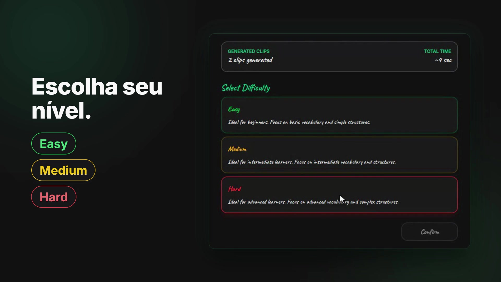
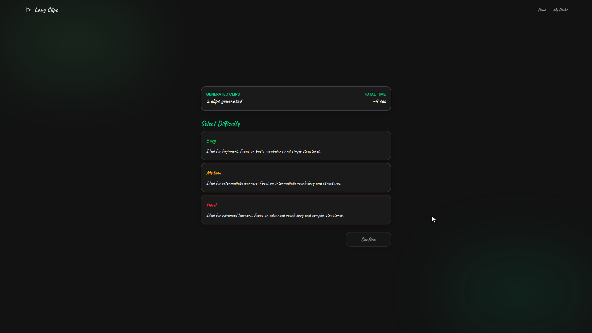
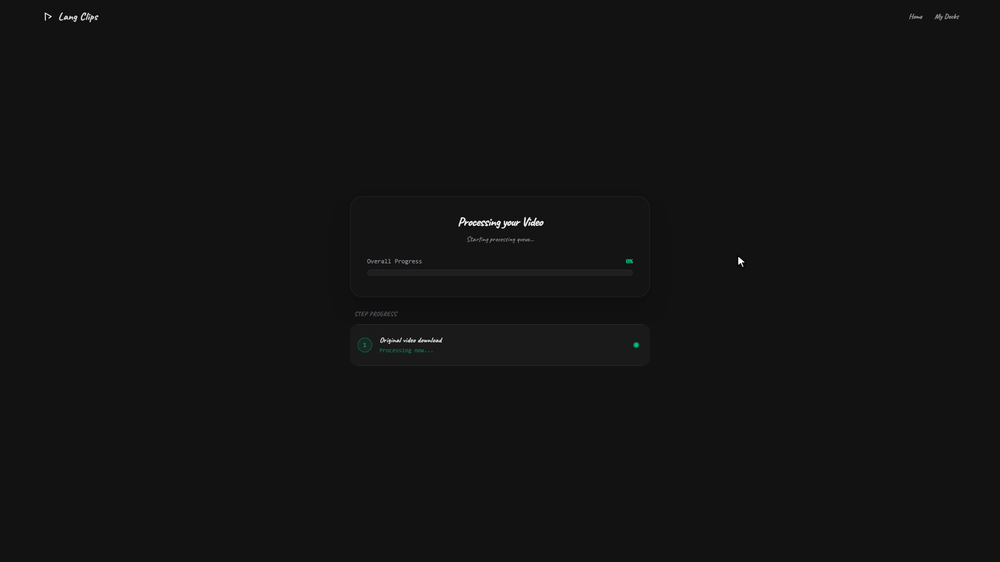
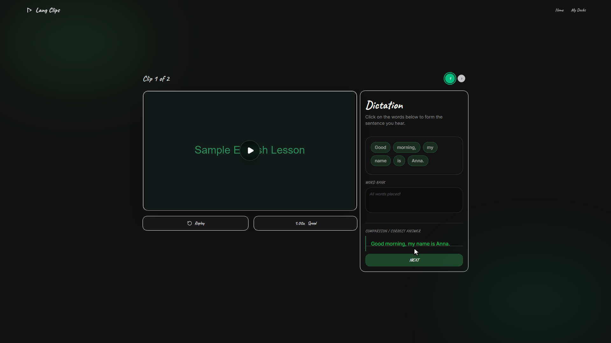
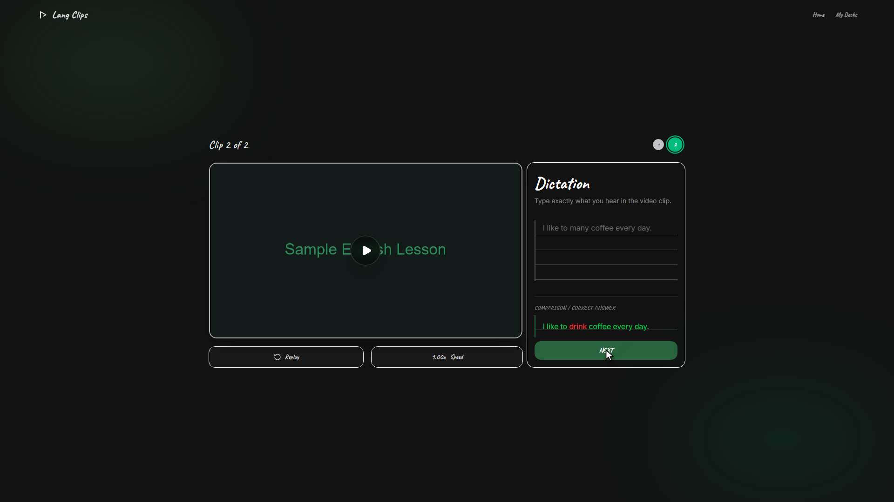
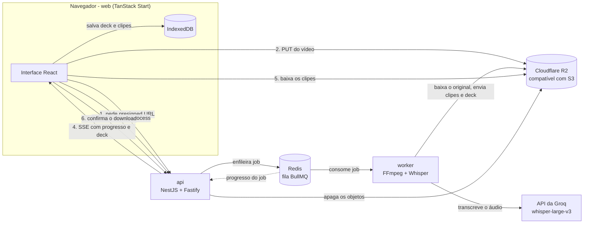

<div align="center">

[English](README.md) | **Português**

# LangClips

**Transforme qualquer vídeo curto em exercícios de listening em inglês, com transcrição por IA, recorte automático em clipes e prática offline-first.**

[](https://github.com/victor-lis-bronzo/langclips/actions/workflows/ci.yml)


[](docs/media/brag.mp4)

<sub>Assista à demo de 30s</sub>

</div>

<!-- VIDEO: for an inline player, drag docs/media/brag.mp4 into the GitHub editor and paste the generated user-attachments URL here on its own line (see issue #10) -->

---

## Sumário

- [O que é o LangClips](#o-que-é-o-langclips)
- [Como funciona](#como-funciona)
- [Níveis de dificuldade](#níveis-de-dificuldade)
- [Capturas de tela](#capturas-de-tela)
- [Arquitetura](#arquitetura)
- [Decisões de engenharia](#decisões-de-engenharia)
- [Tech stack](#tech-stack)
- [Estrutura do repositório](#estrutura-do-repositório)
- [Como executar localmente](#como-executar-localmente)
- [Testes](#testes)
- [Status e roadmap](#status-e-roadmap)
- [Documentação](#documentação)
- [Autoria](#autoria)

## O que é o LangClips

Entender inglês falado a partir de conteúdo real (séries, filmes, entrevistas) é difícil: velocidade nativa, sotaques e fala encadeada fazem a gente "entender metade" do que é dito, e montar exercícios a partir desse material na mão leva tempo.

O **LangClips** automatiza esse trabalho. Você faz o upload de um vídeo curto, a plataforma transcreve o áudio com o Whisper, divide o vídeo em clipes do tamanho de uma frase e transforma cada clipe em um exercício interativo de listening. Não é preciso cadastro e, quando o deck fica pronto, ele é salvo no navegador, então a prática continua funcionando mesmo sem conexão.

## Como funciona

1. **Upload** - arraste um arquivo MP4 ou MOV (até 100 MB). O navegador envia o arquivo direto para o storage por meio de uma presigned URL.
2. **Processamento** - um worker em background extrai o áudio com FFmpeg, transcreve com o Whisper, gera um clipe por segmento transcrito (de 2 a 20 segundos) e monta um *deck*. A interface acompanha cada etapa em tempo real via Server-Sent Events.
3. **Escolha da dificuldade** - Easy, Medium ou Hard.
4. **Prática com feedback** - assista a cada clipe, responda e receba correção palavra a palavra. O deck é salvo no IndexedDB e os arquivos remotos são apagados assim que o download termina.

## Níveis de dificuldade

| Nível | Exercício | Como funciona |
| --- | --- | --- |
| **Easy** | Montar a frase | As palavras da transcrição aparecem embaralhadas em um **Word Bank**; clique nelas na ordem certa para remontar a frase (clicar numa palavra já colocada devolve ela ao banco). |
| **Medium** | Completar as lacunas | Cerca de **35% das palavras** ficam visíveis, distribuídas pela frase; todas as outras viram campos para digitar. |
| **Hard** | Ditado | Digite a frase inteira do zero em uma **textarea pautada, no estilo caderno**. |

Comum a todos os níveis:

- **Player de vídeo** com play/pause, *Replay* e velocidades de **0.5x, 0.75x, 1.00x, 1.25x e 1.5x**.
- **Correção palavra a palavra**: a resposta é alinhada com a transcrição e cada palavra é marcada como exata, com maiúscula/minúscula errada, errada ou faltando (pontuação e apóstrofos são ignorados).
- **Progress dots** mostrando a posição no deck, e uma tela de resultados ao final.

## Capturas de tela

| Escolha da dificuldade | Pipeline de processamento |
| --- | --- |
|  |  |
| **Easy: frase montada, com feedback** | **Hard: ditado com a palavra errada em vermelho** |
|  |  |

## Arquitetura

O projeto é organizado em três pacotes TypeScript independentes (`web`, `api`, `worker`) mais a infraestrutura, cada um com suas próprias dependências e lockfile.



**Pipeline de processamento (worker).** Cada job passa por: download do vídeo original, extração de áudio, transcrição, geração dos clipes, upload dos clipes, construção do deck e upload do deck. O navegador adiciona uma etapa final, o salvamento offline no dispositivo. São exatamente as oito etapas exibidas no stepper de processamento.

**Principais endpoints da API.**

| Método | Rota | Finalidade |
| --- | --- | --- |
| `POST` | `/uploads/generate-presigned-url` | Retorna uma URL de upload de curta duração e a chave do objeto |
| `POST` | `/videos/process` | Enfileira o job de processamento (`202 Accepted`) |
| `GET` | `/videos/events/:jobId` | Stream de Server-Sent Events com o progresso do job e o deck final |
| `GET` | `/storage/download-url` | Presigned URL de download de um clipe |
| `POST` | `/videos/acknowledge-download` | Apaga do bucket o vídeo original e os clipes |

A documentação interativa é servida pelo Swagger em `/docs`, e a fila pode ser inspecionada pelo Bull Board em `/admin/queues`. Veja [docs/api-spec.md](docs/api-spec.md) para a especificação completa.

## Decisões de engenharia

- **Processamento assíncrono com fila.** Extração de áudio, transcrição e recorte são lentos e custosos, então nunca rodam dentro de uma requisição HTTP. A API apenas enfileira um job no Redis via **BullMQ** e responde imediatamente com `202 Accepted`; um **worker** separado consome a fila e reporta o progresso, que a API repassa ao navegador via **SSE**. ([ADR 003](docs/adr/003-processamento-bullmq.md))
- **Upload direto ao storage com presigned URLs.** Os vídeos não passam pela API. O front-end solicita uma presigned URL (válida por 5 minutos e restrita a MIME types de vídeo/áudio) e envia o arquivo direto para o **Cloudflare R2**, um bucket compatível com S3. Isso mantém a API leve e evita dobrar o consumo de banda.
- **Offline-first com IndexedDB.** Quando o deck fica pronto, o navegador baixa os clipes e guarda o deck, os clipes e as tentativas dos exercícios no **IndexedDB** (via `idb`). A reprodução e a validação das respostas acontecem localmente, sem novas requisições. ([ADR 004](docs/adr/004-armazenamento-local-indexeddb.md))
- **Armazenamento efêmero no servidor.** Depois do salvamento local, o cliente confirma o download e a API apaga do bucket o vídeo original e todos os clipes. A API também recusa novos uploads quando o bucket atinge a cota de 5 GB.
- **Front-end type-safe.** TanStack Start + TanStack Router garantem rotas e parâmetros verificados em tempo de compilação, sobre Vite e React 19. ([ADR 001](docs/adr/001-frontend-tanstack-start.md))
- **Back-end modular.** NestJS com o adaptador Fastify, DTOs validados e geração automática de OpenAPI. ([ADR 002](docs/adr/002-backend-nestjs.md))
- **Worker desacoplado.** Cada etapa do processamento fica atrás de uma interface (storage, extrator de áudio, transcritor, recortador, uploader, construtor de deck, limpeza de disco) e é injetada no job, o que mantém cada serviço substituível e testável isoladamente.

## Tech stack

| Camada | Tecnologias |
| --- | --- |
| **Front-end (`web`)** | TanStack Start, TanStack Router, React 19, Vite, Tailwind CSS 4, TanStack Query, TanStack Form, Zod, Radix UI, `idb` (IndexedDB), Biome, Vitest, Playwright |
| **API (`api`)** | NestJS 11 com Fastify, BullMQ, Bull Board, Swagger, AWS SDK v3 (cliente S3 e presigner), class-validator, Jest |
| **Worker (`worker`)** | Node.js, BullMQ, FFmpeg (`fluent-ffmpeg` + `ffmpeg-static` embutido), Whisper `whisper-large-v3` via API da Groq, AWS SDK v3, Zod, tsx/tsup, Vitest |
| **Infraestrutura** | Redis 8 (Docker Compose), Cloudflare R2 (compatível com S3), CI no GitHub Actions |
| **Ferramentas** | pnpm, TypeScript |

## Estrutura do repositório

```text
langclips/
├── web/       # Front-end (TanStack Start): upload, processamento, exercícios, resultados, armazenamento offline
├── api/       # API NestJS: presigned URLs, enfileiramento de jobs, progresso via SSE, limpeza do storage
├── worker/    # Worker em background: FFmpeg, transcrição com Whisper, recorte de clipes e montagem do deck
├── infra/     # Docker Compose do Redis
├── docs/      # Requisitos, ADRs, UML, design, glossário e mídia da demo
└── .github/   # Workflow de CI (lint, typecheck, testes unitários e E2E)
```

## Como executar localmente

### Pré-requisitos

- [Node.js](https://nodejs.org/) 22 (a versão usada no CI)
- [pnpm](https://pnpm.io/) 10
- [Docker](https://www.docker.com/) com Docker Compose (para o Redis)
- Um bucket do Cloudflare R2 (ou outro bucket compatível com S3) e suas chaves de acesso. O navegador envia os arquivos direto para ele, então o bucket precisa aceitar requisições `PUT` vindas da origem do web.
- Uma chave de API da [Groq](https://groq.com/) para a transcrição com Whisper

Não é preciso instalar o FFmpeg: o worker usa o binário distribuído pelo `ffmpeg-static`.

### 1. Variáveis de ambiente

Cada pacote tem seu próprio `.env.example`. Copie para `.env` na mesma pasta e preencha com os seus valores:

```bash
cp infra/.env.example infra/.env
cp api/.env.example api/.env
cp worker/.env.example worker/.env
cp web/.env.example web/.env
```

| Arquivo | Variáveis |
| --- | --- |
| `infra/.env` | `REDIS_PORT`, `REDIS_PASSWORD` |
| `api/.env` | `STORAGE_ENDPOINT`, `STORAGE_REGION`, `STORAGE_ACCESS_KEY_ID`, `STORAGE_SECRET_ACCESS_KEY`, `STORAGE_FORCE_PATH_STYLE`, `STORAGE_BUCKET_NAME`, `PORT` (padrão `3333`), `NODE_ENV`, `REDIS_HOST`, `REDIS_PORT`, `REDIS_PASSWORD` |
| `worker/.env` | As mesmas variáveis `STORAGE_*` e `REDIS_*` da API, mais `GROQ_API_KEY` e `NODE_ENV` |
| `web/.env` | `VITE_API_URL`, `API_URL` (ambas `http://localhost:3333` por padrão) |

O `REDIS_PASSWORD` precisa ser o mesmo em `infra`, `api` e `worker`. O worker valida as variáveis com Zod ao iniciar e encerra se alguma estiver faltando.

### 2. Subir o Redis

```bash
cd infra
docker compose up -d
```

### 3. Instalar e iniciar cada serviço

Não há workspace na raiz: instale e inicie cada pacote em um terminal próprio.

```bash
# API - http://localhost:3333
cd api
pnpm install
pnpm start:dev
```

```bash
# Worker - escuta a fila "video-processing" (sem porta HTTP)
cd worker
pnpm install
pnpm dev
```

```bash
# Web - http://localhost:3000
cd web
pnpm install
pnpm dev
```

| Serviço | URL |
| --- | --- |
| Aplicação web | http://localhost:3000 |
| API | http://localhost:3333 |
| Documentação Swagger | http://localhost:3333/docs |
| Bull Board (filas) | http://localhost:3333/admin/queues |

## Testes

Todos os pacotes têm scripts de lint, typecheck e testes, que o CI executa a cada push e pull request para a `main`.

| Pacote | Comandos |
| --- | --- |
| `web` | `pnpm lint`, `pnpm typecheck`, `pnpm test` (Vitest), `pnpm test:e2e` (Playwright; sobe o servidor de desenvolvimento na porta 3000) |
| `api` | `pnpm lint`, `pnpm typecheck`, `pnpm test` (Jest), `pnpm test:e2e` |
| `worker` | `pnpm lint`, `pnpm typecheck`, `pnpm test` (Vitest) |

## Status e roadmap

O fluxo principal está implementado de ponta a ponta e em fase de polimento. Problemas conhecidos e trabalho planejado:

**Implementado**

- [x] Upload de vídeo (MP4/MOV, até 100 MB) direto para o R2 via presigned URLs
- [x] Processamento com fila: extração de áudio com FFmpeg, transcrição com Whisper, recorte automático e montagem do deck
- [x] Progresso do processamento em tempo real via Server-Sent Events (stepper de 8 etapas)
- [x] Três níveis de dificuldade: Easy (Word Bank), Medium (lacunas), Hard (ditado)
- [x] Player de vídeo com replay e velocidades de 0.5x a 1.5x
- [x] Correção palavra a palavra e tela de resultados
- [x] Armazenamento offline-first de decks, clipes e tentativas no IndexedDB, com biblioteca de decks
- [x] Arquivos remotos apagados do bucket após o download local
- [x] CI com lint, typecheck, testes unitários e testes E2E com Playwright

**Problemas conhecidos**

- [ ] [#3](https://github.com/victor-lis-bronzo/langclips/issues/3) - A tela de resultados perde os exercícios do 1º clipe ao abrir o 2º
- [ ] [#4](https://github.com/victor-lis-bronzo/langclips/issues/4) - Investigar por que frases curtas geram menos clipes que o esperado
- [ ] [#5](https://github.com/victor-lis-bronzo/langclips/issues/5) - Definir a regra de acerto (`isHit`) para frases curtas

**Planejado** (a partir do [escopo do projeto](docs/conceito.md))

- [ ] Tradução de cada frase para o português
- [ ] Contas de usuário (email e Google)
- [ ] Histórico de vídeos processados e salvamento de vocabulário
- [ ] Gamificação e pontuação progressiva
- [ ] Armazenamento em nuvem para compartilhar decks

## Documentação

| Tema | Link |
| --- | --- |
| Escopo do projeto (conceito inicial) | [docs/conceito.md](docs/conceito.md) |
| Glossário | [docs/glossario/termos.md](docs/glossario/termos.md) |
| Architecture Decision Records | [docs/adr](docs/adr) |
| Requisitos funcionais | [docs/requisitos/funcionais/rf-lista.md](docs/requisitos/funcionais/rf-lista.md) |
| Requisitos não funcionais | [docs/requisitos/nao-funcionais/rnf-lista.md](docs/requisitos/nao-funcionais/rnf-lista.md) |
| Regras de negócio | [docs/requisitos/regras/br-lista.md](docs/requisitos/regras/br-lista.md) |
| Product backlog | [docs/requisitos/backlogs/bl-lista.md](docs/requisitos/backlogs/bl-lista.md) |
| Technical Design Document | [docs/TDD/tdd.md](docs/TDD/tdd.md) |
| Especificação da API | [docs/api-spec.md](docs/api-spec.md) |
| Modelo de dados local (IndexedDB) | [docs/data-model.md](docs/data-model.md) |
| Diagramas UML | [docs/uml](docs/uml) |
| Padrões visuais, wireframes e telas do Figma | [docs/design/patterns.md](docs/design/patterns.md), [docs/design/wireframes](docs/design/wireframes), [docs/design/figma](docs/design/figma) |
| Personas | [docs/personas](docs/personas) |
| Vídeo de demo, pôsteres e textos de divulgação | [docs/media](docs/media) |

## Autoria

Desenvolvido por **Victor Lis Bronzo**.

[](https://github.com/victor-lis-bronzo)
[](https://linkedin.com/in/victor-lis-bronzo)
