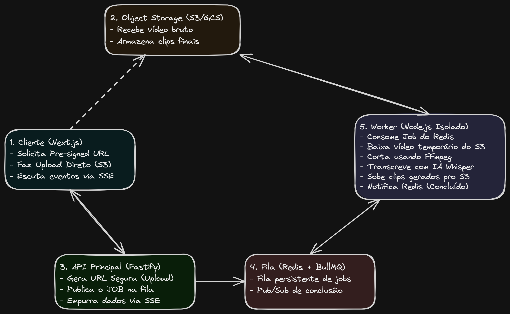

# TDD: LangClips - Technical Design Document

**Autor(es):** Victor Lis Bronzo  
**Data:** 01/07/2026  
**Status:** Draft

---

## 1. Contexto e Objetivo

_Qual é o problema real que estamos resolvendo? Evite jargões aqui. Descreva a dor do negócio ou do sistema e o que esta solução vai alcançar de forma mensurável._

- A ideia é criar uma plataforma que, sem custos ou com custos baixos, seja possível entregar materiais de vídeo (em Inglês) e gerar exercícios de audição;
- É possível ver a tradução de palavras desconhecidas, tentar adivinhar as palavras ditas, também sendo possível ver a tradução completa;

## 2. Escopo

_O que vamos entregar agora e o que está expressamente proibido de ser feito nesta versão para evitar o aumento descontrolado do escopo (scope creep)._

### In Scope

- Criação do frontend
- Criação do backend
- Criação da fila de processamento
- Criação do banco de dados IndexedDB para armazenamento local

### Out of Scope

- Sistema de autenticação;
- Banco de dados em nuvem;
- Criação de novas funcionalidades (além do escopo definido);

## 3. Arquitetura da Solução Proposta



## 4. Stack Tecnológica e Infraestrutura

_Defina as ferramentas e justifique de forma técnica, não por preferência pessoal._

- **Frontend:** Next.js (React) + Tailwind CSS + localforage (para facilitar manipulação do IndexedDB).
  - _Justificativa:_ Next.js atende ao requisito de UI moderna. O localforage abstrai a complexidade do IndexedDB permitindo salvar Blobs de vídeo de forma assíncrona com API baseada em Promises.
- **Backend (API):** Node.js com Fastify.
  - _Justificativa:_ Fastify suporta um throughput muito maior que o Express e possui ecossistema maduro para rate-limiting (`@fastify/rate-limit`) e SSE (`@fastify/reply-from` / streams nativas).
- **Fila e Cache:** Redis + BullMQ.
  - _Justificativa:_ BullMQ lida nativamente com controle de concorrência, retentativas e isolamento de jobs, essencial para não derrubar o servidor rodando FFmpeg.
- **Processamento de Mídia:** Worker Node.js isolado + fluent-ffmpeg + OpenAI Whisper API.
  - _Justificativa:_ Separar a extração de áudio/cortes da API principal evita que o event loop do Node bloqueie.
- **Object Storage (Nuvem):** Cloudflare R2.
  - _Justificativa (Foco em Custo):_ Ao contrário do AWS S3, o R2 não cobra taxa de egress (banda de saída). Como vídeos consomem muita banda, isso anula o risco de faturas astronômicas.

## 5. Modelo de Dados

### 5.1. Armazenamento Local (IndexedDB - Cliente)

Como a aplicação deve funcionar offline, os dados e mídias precisam viver no navegador do usuário.

#### Store: `decks` (Armazena a sessão/coleção de exercícios)

- `id` (String, UUID)
- `title` (String)
- `createdAt` (Timestamp)

#### Store: `clips` (Armazena os exercícios individuais)

- `id` (String, UUID)
- `deckId` (String, FK para `decks`)
- `mediaBlob` (Blob - O arquivo de vídeo real salvo no dispositivo do usuário)
- `transcription` (Array de Objetos: `[{ word: "hello", start: 0.5, end: 1.0, isGap: false }]`)
- `status` (Enum: `PENDING`, `DONE`)

### 5.2. Estrutura do Redis (Servidor)

#### BullMQ Queue: `video-processing`

- `jobId`: UUID
- `data`: `{ fileKey: "uploads/abc-123.mp4", durationLimit: 180, language: "en" }`

## 6. Contratos de API (Endpoints)

Todos os endpoints do Fastify. Não há tráfego de Blob/Vídeo através da API para evitar OOM (Out of Memory).

### `POST /api/v1/uploads/presigned-url`

- **Objetivo:** Retorna uma URL segura e temporária para o frontend fazer o upload direto no Cloudflare R2.
- **Request Body:**
  ```json
  {
    "filename": "video.mp4",
    "fileSize": 45000000,
    "contentType": "video/mp4"
  }
  ```
- **Response (200 OK):**
  ```json
  {
    "uploadUrl": "https://<bucket>.r2.cloudflarestorage.com/tmp/abc-123.mp4?signature=...",
    "fileKey": "tmp/abc-123.mp4"
  }
  ```

### `POST /api/v1/jobs/process`

- **Objetivo:** Avisa o backend que o upload no S3/R2 terminou e insere na fila de processamento.
- **Request Body:**
  ```json
  {
    "fileKey": "tmp/abc-123.mp4"
  }
  ```
- **Response (202 Accepted):**
  ```json
  {
    "jobId": "uuid-do-bullmq",
    "status": "QUEUED"
  }
  ```

### `GET /api/v1/jobs/:jobId/events`

- **Objetivo:** Conexão SSE (Server-Sent Events). O frontend fica escutando aqui até o processamento terminar.
- **Headers:** `Accept: text/event-stream`
- **Response Stream:**

  ```http
  data: {"status": "PROCESSING", "progress": 50}

  data: {"status": "COMPLETED", "clips": [...dados textuais e urls finais...]}
  ```

## 7. Segurança, Riscos e Gargalos (Invoice Protection)

Medidas paranoicas para proteger a infraestrutura e o bolso.

- **Risco 1:** Fatura estourar por armazenamento fantasma no S3/R2.
  - _O problema:_ O usuário upa o arquivo, fecha a aba, e o arquivo fica ocupando espaço na nuvem pra sempre.
  - _Mitigação:_ Configurar Lifecycle Rules no bucket (S3/R2). Qualquer arquivo no prefixo `tmp/` é deletado automaticamente pelo provedor após 10 minutos. A API nunca precisa se preocupar em deletar.
- **Risco 2:** Ataque DDoS abusando da API do Whisper.
  - _O problema:_ Bater na API da OpenAI custa dinheiro. Um bot pode automatizar chamadas ao seu sistema.
  - _Mitigação:_ Implementar `@fastify/rate-limit`. Máximo de 5 envios de vídeos por IP a cada 1 hora. Implementar Cloudflare Turnstile (Captcha invisível) no Frontend antes de solicitar a pre-signed URL.
- **Risco 3:** Arquivos maliciosos ou gigantes.
  - _Mitigação:_ A Pre-signed URL será assinada com um limite estrito de Content-Length-Range de 1MB a 50MB. Se o usuário tentar upar 51MB direto no R2, o provedor rejeita.
- **Risco 4:** OOM (Out of Memory) no IndexedDB.
  - _O problema:_ Dispositivos mobile tem limites rígidos de IndexedDB. Se o usuário salvar 20 decks de vídeo, o navegador vai estourar e a página crasha.
  - _Mitigação:_ Implementar uma política de LRU (Least Recently Used) no Frontend. Ao salvar um novo deck, o sistema do IndexedDB deleta o deck mais antigo, substituindo ele.

## 8. Alternativas Consideradas

- **FFmpeg via WebAssembly (WASM) rodando direto no navegador (Frontend):**
  - _Por que foi rejeitada:_ Parecia uma excelente ideia para economizar custos de servidor, forçando o PC do usuário a fazer o corte do vídeo. Porém, contraria a Persona Paulo Barbosa (PCs fracos de escolas). Processar vídeo em um i3 de 4ª geração via WASM faria o navegador travar, arruinando a experiência.
- **WebSockets vs Server-Sent Events (SSE):**
  - _Por que foi rejeitada:_ WebSockets são bidirecionais e consomem mais recursos/setup (ping/pong frames). Como precisamos apenas que o servidor informe o cliente que o vídeo ficou pronto, o SSE é mais leve, opera no protocolo HTTP padrão e é nativamente suportado por navegadores sem bibliotecas pesadas como Socket.io.
