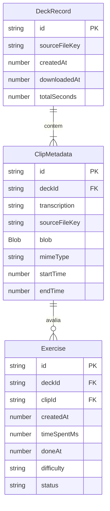

# Modelo de Dados Local (IndexedDB & Estado Global)

Na Fase 1 do **LangClips**, a persistência de dados ocorre exclusivamente no cliente via **IndexedDB** (utilizando a biblioteca wrapper `idb`). Este documento especifica o esquema das entidades gravadas na aplicação.

---

## 1. Esquema do IndexedDB

A base de dados no navegador é organizada em Object Stores desacopladas para armazenar de maneira volátil ou semi-permanente a mídia e os resultados dos exercícios.



---

## 2. Definição das Interfaces TypeScript

### 2.1. `ClipMetadata`
Armazena a mídia recortada de um trecho específico juntamente com a transcrição oficial gerada.

```typescript
export interface ClipMetadata {
  /** Identificador único do clipe (UUID) */
  id: string;
  
  /** ID do deck proprietário ao qual este clipe pertence */
  deckId: string;
  
  /** Texto transcrito/legenda oficial para o trecho */
  transcription: string;
  
  /** Identificador da chave do arquivo de origem */
  sourceFileKey: string;
  
  /** Arquivo binário (áudio/vídeo) recortado mantido localmente */
  blob: Blob;
  
  /** Tipo do arquivo (ex: 'video/mp4', 'audio/mp3') */
  mimeType: string;
  
  /** Ponto inicial do recorte no vídeo original (em segundos) */
  startTime: number;
  
  /** Ponto final do recorte no vídeo original (em segundos) */
  endTime: number;
}
```

---

### 2.2. `DeckRecord`
Agrupa uma sessão de aprendizado gerada a partir de um único vídeo enviado pelo usuário.

```typescript
export interface DeckRecord {
  /** Identificador único do deck (UUID) */
  id: string;
  
  /** Chave do arquivo de origem processado no servidor */
  sourceFileKey: string;
  
  /** Resumo/lista dos clipes sem o payload binário do Blob */
  clips: Omit<ClipMetadata, "blob" | "mimeType">[];
  
  /** Timestamp de criação do deck (ms) */
  createdAt: number;
  
  /** Timestamp em que o download dos arquivos foi concluído no cliente */
  downloadedAt: number;
  
  /** Duração total acumulada em segundos dos recortes */
  totalSeconds: number;
}
```

---

### 2.3. `Exercise`
Registra a tentativa e desempenho do usuário em um clipe específico.

```typescript
export interface Exercise {
  /** Identificador único da resolução do exercício */
  id: string;
  
  /** ID do deck correspondente */
  deckId: string;
  
  /** ID do clipe praticado */
  clipId: string;
  
  /** Timestamp em que o exercício foi iniciado */
  createdAt: number;
  
  /** Tempo total gasto pelo usuário para responder (em milissegundos) */
  timeSpentMs: number;
  
  /** Timestamp da conclusão da resposta */
  doneAt: number;
  
  /** Dificuldade selecionada: 'EASY' | 'MEDIUM' | 'HARD' */
  difficulty: "EASY" | "MEDIUM" | "HARD";
  
  /** Resultado da verificação */
  status: "CORRECT" | "WRONG";
}
```

---

## 3. Estado Global e Preferências de Usuário

Além do IndexedDB para itens volumosos, preferências leves de uso são gerenciadas através do LocalStorage/TanStack Store:

```typescript
export interface UserPreferences {
  /** Velocidade padrão do áudio/vídeo (ex: 1.0, 0.75) */
  playbackSpeed: number;
  
  /** Dificuldade preferida selecionada por padrão */
  defaultDifficulty: "EASY" | "MEDIUM" | "HARD";
  
  /** Exibir legenda automaticamente durante a reprodução do exercício */
  showSubtitlesByDefault: boolean;
}
```
